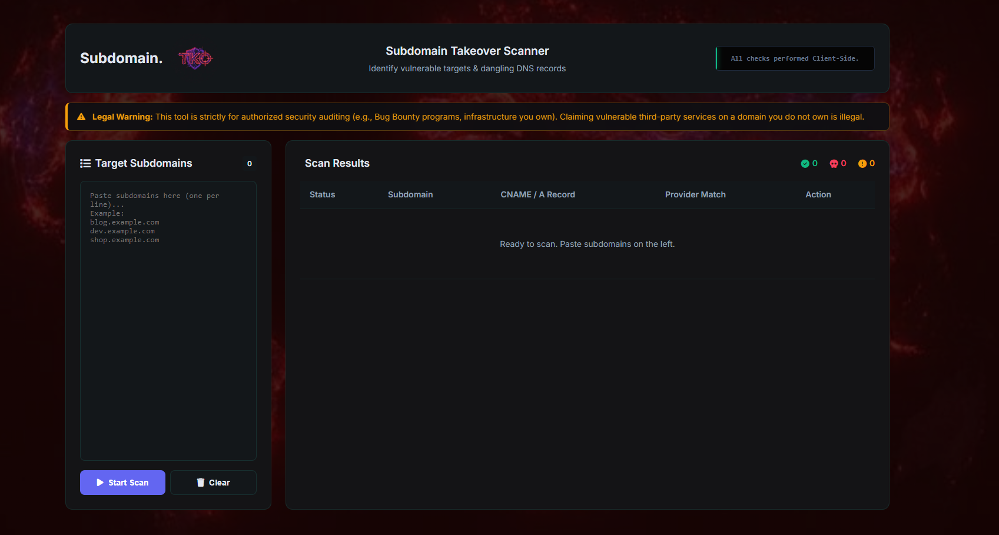

  
  
  # SubdomainTKO
  **Client-Side Subdomain Takeover Scanner**

SubdomainTKO is a **100% client-side** security tool for identifying vulnerable targets and dangling DNS records. It operates seamlessly within your browser by utilizing DNS-over-HTTPS (DoH) APIs to resolve domains without requiring a backend server.

## Features

- **No Backend Required:** All DNS queries are performed securely and locally from your browser.
- **Provider Signatures:** Scans CNAME records against a built-in signature database for popular cloud providers (AWS S3, GitHub Pages, Shopify, Heroku, Azure, Zendesk).
- **Remediation Details:** Displays how a specific takeover vector works and provides actionable remediation steps.

## Usage

1. Open `index.html` in your web browser.
2. Paste a list of subdomains you want to check (one per line) into the target input box.
3. Click **Start Scan** and view the real-time results.

## Legal Disclaimer

⚠️ **Warning:** This tool is strictly for authorized security auditing. It must only be used on infrastructure you own, are explicitly authorized to test, or within the scope of an official Bug Bounty program. 

Claiming vulnerable third-party services on a domain you do not own is illegal. The author is not responsible for any misuse.
